<div align="center">

# 🧵 KARIGARI

### Where Every Piece Tells a Handmade Story.

**An AI-powered digital marketplace connecting artisans with buyers through handmade commerce.**

<br>

<p align="center">
  
</p>

<br>

**Flutter** · **Firebase** · **Firebase AI** · **Cloudinary** · **Razorpay**

</div>

---

# ✨ What is Karigari?

**Karigari** is a full-stack Flutter e-commerce application designed to
connect **local artisans with buyers through a digital marketplace for handmade products.**

It brings together two sides of commerce:

| 🛍️ Buyer | 🎨 Seller |
|:---:|:---:|
| Discover handmade products | Manage products |
| Explore craft stories | Receive orders |
| Add to cart | Track sales |
| Razorpay checkout | View analytics |
| AI shopping assistant | AI-powered growth tools |

> **Make handmade commerce easier to discover, easier to sell, and smarter to grow.**

---

# 💡 Why Karigari?

Local artisans create unique products, but reaching customers and understanding
their business digitally can be difficult.

Karigari connects the complete journey:

<div align="center">

### ARTISAN → PRODUCT → DISCOVERY → PURCHASE → DATA → INSIGHT → GROWTH

</div>

A purchase is not treated as the end of the journey.

**Every order becomes useful business data for the artisan.**

---

# 🚀 What Can Karigari Do?

## 🛍️ Buyer

- Browse handmade products
- Search and explore categories
- View product details and craft stories
- Add products to cart
- Checkout with shipping details
- Pay through Razorpay
- Use the AI shopping assistant

## 🎨 Seller

- Seller authentication
- Seller dashboard
- Upload products
- Manage product catalogue
- Receive new-order notifications
- View order details
- Track revenue and orders
- Analyze product performance
- Generate AI growth insights
- Generate product listing content
- Generate campaign ideas

---

# 🤖 AI Experience

Karigari uses AI where it can actually improve the experience.

## Buyer AI

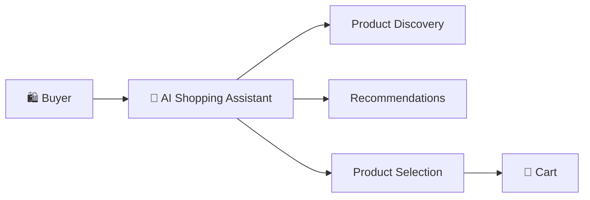

The shopping assistant helps buyers discover products through a conversational experience.

---

## Seller AI

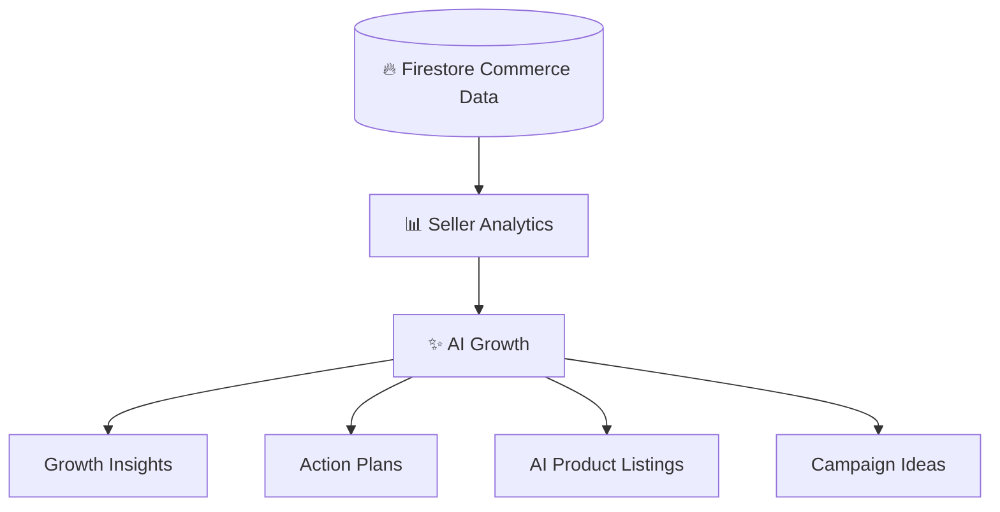

**AI helps buyers discover and helps sellers act.**

---

# 💳 Commerce & Payment Flow

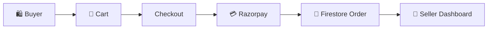

After successful payment, the order is stored in Firestore and becomes
available to the corresponding seller.

---

# 🏗️ Architecture

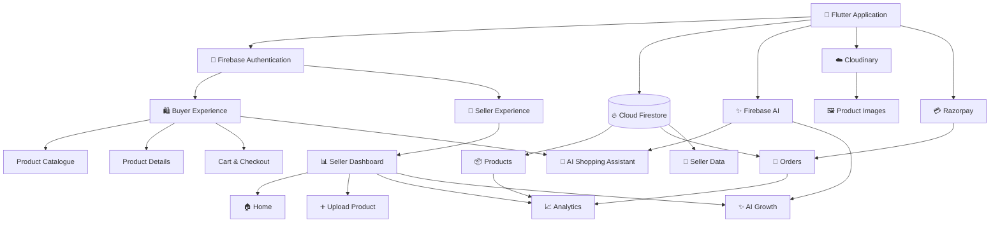

---

# 🔄 How It Works

## Product Flow

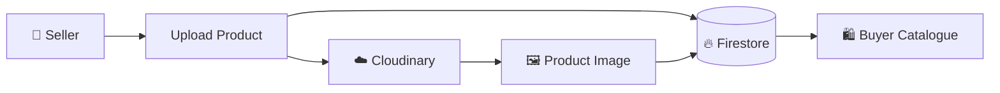

---

## Order Flow

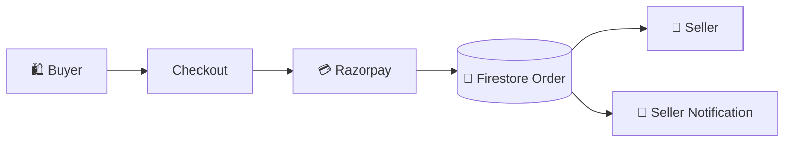

---

## Analytics Flow

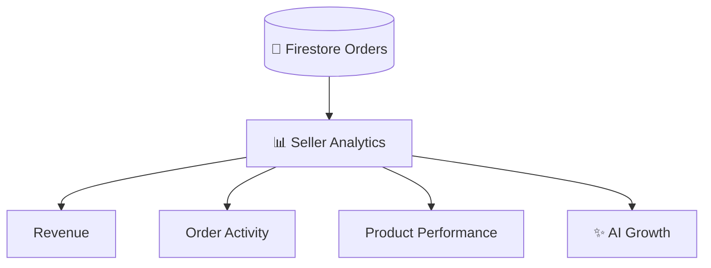

---

# 🧩 Application Structure

```text
Karigari_app/
│
├── assets/
│   └── images/
│
├── screenshots/
│   └── karigari_showcase.gif
│
├── lib/
│   │
│   ├── Authentication
│   │   ├── Buyer Login
│   │   └── Seller Login
│   │
│   ├── Buyer
│   │   ├── Product Catalogue
│   │   ├── Product Details
│   │   ├── Cart
│   │   ├── Checkout
│   │   └── AI Shopping Assistant
│   │
│   ├── Seller
│   │   ├── Seller Dashboard
│   │   ├── Seller Home
│   │   ├── Product Upload
│   │   ├── Orders
│   │   ├── Order Details
│   │   ├── Analytics
│   │   └── AI Growth
│   │
│   └── ...
│
├── android/
├── ios/
├── pubspec.yaml
└── README.md
```

> The application is organized around its buyer and seller experiences and their
> respective features rather than following a formal architecture pattern such
> as Clean Architecture or BLoC.

---

# 🛠️ Technology Stack

| Layer | Technology | Purpose |
|---|---|---|
| 📱 Frontend | Flutter + Dart | Mobile application |
| 🔐 Authentication | Firebase Authentication | User authentication |
| 🗄️ Database | Cloud Firestore | Products, orders & seller data |
| 🤖 AI | Firebase AI | Buyer & seller AI features |
| 🖼️ Media | Cloudinary | Product images |
| 💳 Payments | Razorpay | Payment processing |

---

# 📊 Seller Intelligence

Karigari turns commerce data into actionable information.


Seller analytics provide visibility into:

- Revenue
- Orders
- Order activity
- Product performance
- Strong-performing products
- Products without completed sales
- Growth opportunities

These insights can lead to:

**Insights → Actions → Listings → Campaigns**

---

# 🎨 Design Philosophy

### 🧵 Human

Handmade products are presented as more than inventory.

### ⚡ Simple

Complex technology stays behind a simple shopping and selling experience.

### 🧠 Intelligent

Data and AI should help users **make decisions and take action**.

---

# 🔐 Services

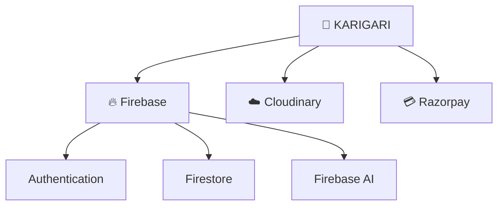

---

# 🎯 Complete User Journey

## Buyer

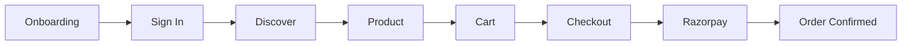

## Seller

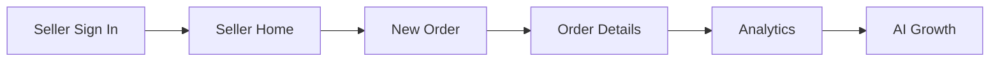

---

# 🚀 Getting Started

## Requirements

- Flutter SDK
- Dart SDK
- Android Studio or VS Code
- Firebase project
- Cloudinary account
- Razorpay account

Check your Flutter setup:

```bash
flutter doctor
```

## Installation

```bash
git clone <your-repository-url>

cd Karigari_app

flutter pub get

flutter run
```

---

# 🔑 Configuration

Karigari requires configuration for:

```text
Firebase
├── Authentication
├── Firestore
└── Firebase AI

Cloudinary
└── Product Images

Razorpay
└── Payments
```

Add the required project configuration before running the application.

> ⚠️ Never commit production secrets or private API credentials to GitHub.

---

# 🎬 The Complete Loop

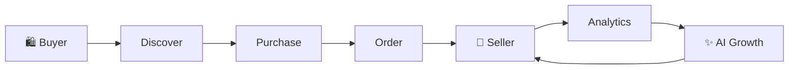

<div align="center">

### Discover → Purchase → Learn → Grow

<br>

## 🧵 KARIGARI

### Where Every Piece Tells a Handmade Story.

<br>

**Built with Flutter · Firebase · Firebase AI · Cloudinary · Razorpay**

</div>